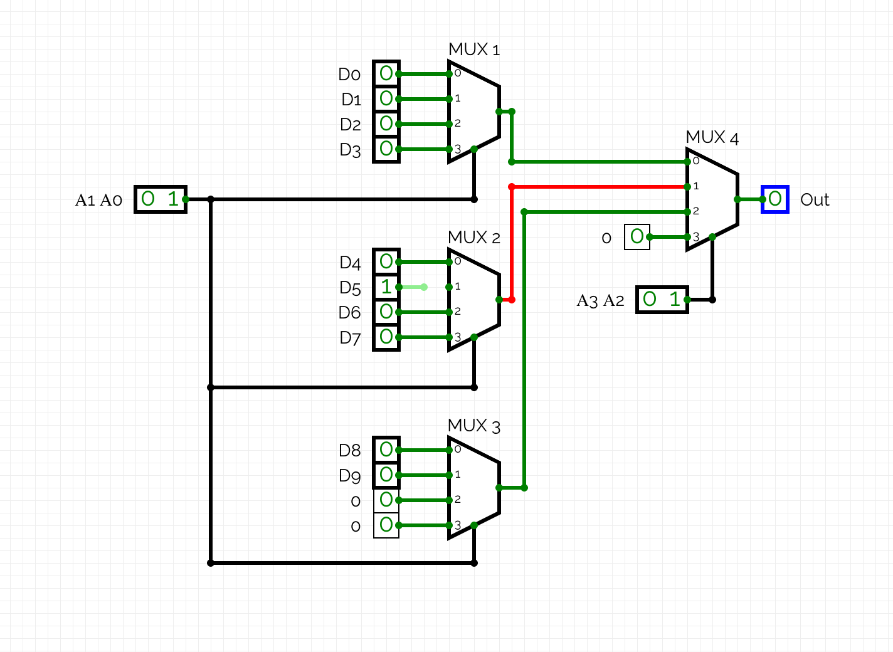
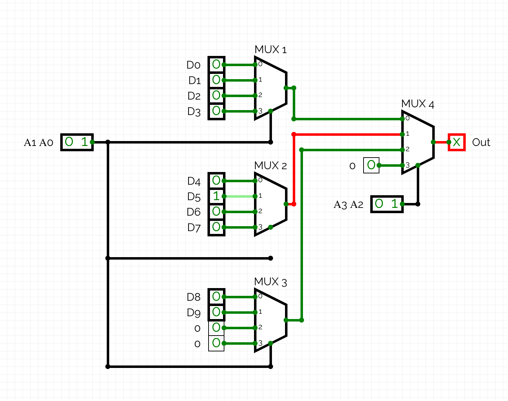
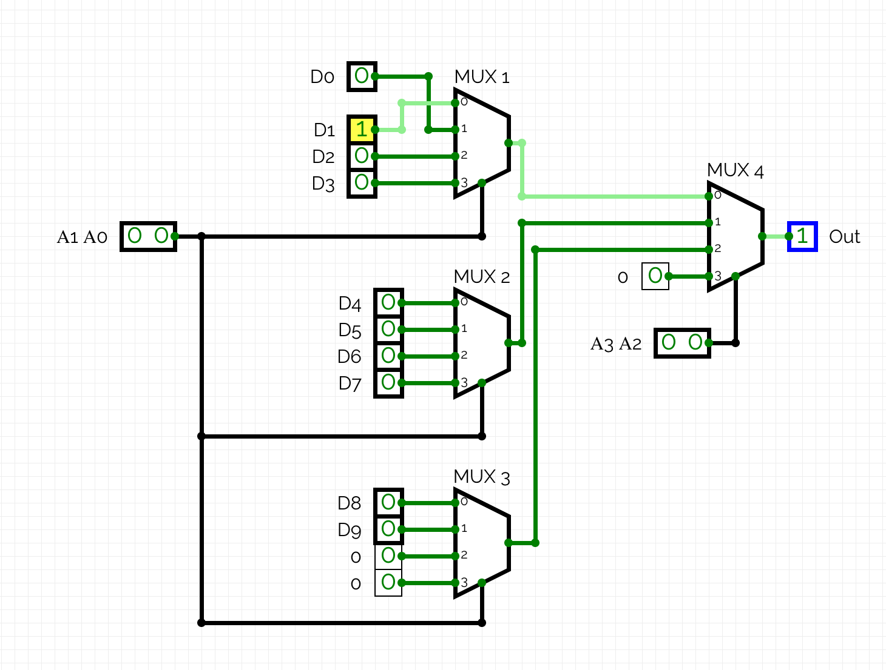

# Мультиплексор 10→1

> **Проект:** разработка и тестирование мультиплексора 10→1  
> **Среда моделирования:** CircuitVerse  
> **Язык программирования:** Python  
> **Фреймворк тестирования:** pytest

---

## Описание

**Мультиплексор 10→1** — цифровое устройство, которое передаёт на выход значение одного из десяти информационных входов в зависимости от комбинации адресных сигналов.

### Основные характеристики

| Параметр | Значение |
|---|---|
| Информационные входы | `D0–D9` |
| Адресные входы | `A3–A0` |
| Выход | `OUT` |
| Количество информационных входов | **10** |
| Количество адресных входов | **4** |

Адресные входы `A3–A0` определяют, какой информационный вход будет подключён к выходу `OUT`.

---

## Схема

Схема разработана в **CircuitVerse**.

🔗 **[Открыть проект в CircuitVerse](https://circuitverse.org/users/467194/projects/untitle-c1834be5-9dbc-4834-96ba-9b0fc6dbcbb3)**

### Структура схемы

Мультиплексор 10→1 построен на основе **четырёх мультиплексоров 4→1**.

| Мультиплексор | Информационные входы | Адресные входы | Выход |
|---|---|---|---|
| `MUX 1` | `D0, D1, D2, D3` | `A1, A0` | `X0` |
| `MUX 2` | `D4, D5, D6, D7` | `A1, A0` | `X1` |
| `MUX 3` | `D8, D9, 0, 0` | `A1, A0` | `X2` |
| `MUX 4` | `X0, X1, X2, 0` | `A3, A2` | `OUT` |

> `0` означает постоянный логический ноль.

---

# Принцип работы

## Таблица работы мультиплексора

Адресные входы определяют выбранный информационный вход.

| Адрес `A3 A2 A1 A0` | Выбранный вход |
|---|---|
| `0000` | `D0` |
| `0001` | `D1` |
| `0010` | `D2` |
| `0011` | `D3` |
| `0100` | `D4` |
| `0101` | `D5` |
| `0110` | `D6` |
| `0111` | `D7` |
| `1000` | `D8` |
| `1001` | `D9` |

> ⚠️ Адреса `1010–1111` являются недопустимыми, поскольку информационных входов `D10–D15` нет.

## Тестирование

### 1. Функциональное тестирование

Проверяются все 10 допустимых комбинаций адресных входов `A3–A0`.

| № | Адрес | Вход | OUT |
|---|---|---|---|
| 1 | `0000` | `D0` | `0` |
| 2 | `0001` | `D1` | `1` |
| 3 | `0010` | `D2` | `0` |
| 4 | `0011` | `D3` | `1` |
| 5 | `0100` | `D4` | `0` |
| 6 | `0101` | `D5` | `1` |
| 7 | `0110` | `D6` | `0` |
| 8 | `0111` | `D7` | `1` |
| 9 | `1000` | `D8` | `0` |
| 10 | `1001` | `D9` | `1` |

### 2. Проверка недопустимых адресов

Проверяются адреса `1010–1111`.

| № | Адрес | Результат |
|---|---|---|
| 11 | `1010` | ❌ Недопустимый |
| 12 | `1011` | ❌ Недопустимый |
| 13 | `1100` | ❌ Недопустимый |
| 14 | `1101` | ❌ Недопустимый |
| 15 | `1110` | ❌ Недопустимый |
| 16 | `1111` | ❌ Недопустимый |

> **Итого:** проверено 16 возможных адресов: 10 допустимых и 6 недопустимых.

## Программная реализация

Для дополнительной проверки разработана программная модель мультиплексора на Python.

Основной файл:

`multiplexer.py`

### Пример использования

```python
from multiplexer import Mux10

mux = Mux10([
    0, 1, 0, 1, 0,
    1, 0, 1, 0, 1
])

result = mux.select(0, 0, 1, 0)

print(result)
```

Результат:

```text
0
```

Адрес `0010` выбирает вход `D2`.

Так как:

```text
D2 = 0
```

на выходе получается:

```text
OUT = 0
```


### Проверки программы

Таким образом, программа выполняет следующие проверки:

| Проверка                       | Требование         |
| ------------------------------ | ------------------ |
| Количество входов              | Ровно 10           |
| Значения информационных входов | Только `0` или `1` |
| Значения адресных входов       | Только `0` или `1` |
| Адреса `1010–1111`             | Недопустимы        |


# Автоматическое тестирование

Для автоматического тестирования используется `pytest`.

### Запуск

```bash
python -m pytest
```

Тесты находятся в двух файлах:

- `test_mux.py`
- `test_fault.py`

### `test_mux.py`

Проверяет:

- выбор всех 10 информационных входов;
- недопустимые адреса;
- неправильное количество входов;
- недопустимые значения информационных входов;
- недопустимые значения адресных входов.

### `test_fault.py`

Проверяет моделирование неисправностей:

- `stuck-at-0`;
- `stuck-at-1`;
- инверсию выхода;
- `A0 stuck-at-0`;
- `D5 stuck-at-0`;
- неправильный выбор входа.

**# Тестирование кабельного соединения**

Дополнительно разработаны тест-кейсы для тестирования кабельного соединения мультиплексора.

Цель тестирования — проверить корректность передачи информационных и адресных сигналов между входами мультиплексора и соответствующими линиями подключения, а также определить возможные неисправности кабеля и разъёмов.

**## Проверяемые неисправности**

Проверяются следующие типы неисправностей:

| Неисправность                                  | Возможное проявление                                                       |
| ---------------------------------------------- | -------------------------------------------------------------------------- |
| Обрыв информационного проводника               | Выбранный информационный сигнал не передаётся на вход MUX                  |
| Обрыв адресного проводника                     | Выбирается неправильный информационный вход                                |
| Короткое замыкание информационных линий        | На вход MUX поступает неправильный или нестабильный сигнал                 |
| Короткое замыкание сигнальной линии на GND     | Сигнал принудительно принимает логический `0`                              |
| Короткое замыкание сигнальной линии на питание | Сигнал принудительно принимает логическую `1`                              |
| Перепутаны информационные линии                | При выборе одного входа фактически используется другой                     |
| Перепутаны адресные линии                      | Формируется неправильный адрес выбора                                      |
| Неправильная распиновка разъёма                | Сигналы поступают не на соответствующие входы                              |
| Плохой контакт информационной линии            | Сигнал может отсутствовать или становиться нестабильным                    |
| Плохой контакт адресной линии                  | Адрес выбора может изменяться или определяться неправильно                 |
| Повреждение/перелом проводника                 | Возможен обрыв или периодическая потеря сигнала                            |
| Повреждение изоляции                           | Возможен контакт проводника с другой линией                                |
| Деформация разъёма                             | Возможна потеря или нестабильность контакта                                |
| Окисление/загрязнение контактов                | Возможно увеличение сопротивления контакта и нестабильная передача сигнала |

## Тест-кейсы кабельного соединения

# TC_MUX_001 — Обрыв информационного проводника D5

Предусловия:

Мультиплексор подключён.
На вход D5 подаётся логическая 1.
Установлен адрес `0101`, соответствующий входу D5.

Шаги:

Зафиксировать нормальное значение OUT.
Разорвать соединение D5 с входом мультиплексора.
Повторно проверить OUT.

Ожидаемый результат:

При исправном соединении OUT = 1.
После обрыва значение D5 не поступает на вход мультиплексора.
OUT не должен корректно повторять исходное значение D5.

### Реализация

Для проверки была разорвана линия, соединяющая вход D5 с мультиплексором.

До возникновения неисправности при адресе `0101` на выходе присутствовало значение D5.

После разрыва линии при первом выборе адреса `0101` на выходе появляется неопределённое состояние `X`.

При переключении на другой адрес выход принимает значение `0`. При повторном выборе адреса `0101` выход также остаётся равным `0`, поскольку сигнал D5 больше не поступает на вход мультиплексора.

Таким образом, разрыв линии D5 приводит к потере корректного сигнала выбранного входа.




## TC_MUX_002 — Обрыв адресного проводника A0

Предусловия:

На информационные входы поданы известные логические значения.
Установлен адрес `0101`, соответствующий D5.

Шаги:

Проверить, что выбран D5.
Разорвать соединение A0.
Повторно проверить выбранный вход и OUT.

Ожидаемый результат:

При исправном соединении выбирается D5.
После обрыва A0 адрес определяется некорректно.
OUT может соответствовать другому информационному входу.

### Реализация 

Для проверки была разорвана линия A0, отвечающая за выбор входа мультиплексора.

До возникновения неисправности при адресе `0101` на выходе присутствовало значение D5.

После разрыва линии при первом выборе адреса `0101` на выходе появляется неопределённое состояние `X`.

Изначально был установлен адрес `0101`, при котором выбирается вход D5. После разрыва линии A0 при переключении адресов мультиплексор перестаёт корректно определять выбранный вход.

При возврате к адресу `0101` выход не соответствует исходному значению D5, что свидетельствует о нарушении адресного сигнала.



## TC_MUX_003 — Перепутаны информационные линии D0 и D1

Предусловия:

D0 = 0.
D1 = 1.
Остальные входы имеют известные значения.

Шаги:

Установить адрес `0000`.
Проверить OUT.
Поменять местами подключения D0 и D1.
Повторно установить адрес `0000`.
Проверить OUT.

Ожидаемый результат:

При исправном подключении OUT = D0 = 0.
После перестановки на физический вход D0 поступает значение D1.
При выборе D0 значение OUT = 1.

### Реализация 

Для проверки были установлены значения D0 = 0 и D1 = 1. Сначала был установлен адрес `0000`, соответствующий выбору входа D0. На выходе OUT наблюдалось значение 0.

После этого подключения D0 и D1 были поменяны местами. При повторной установке адреса `0000` мультиплексор продолжает выбирать вход D0, однако теперь на него поступает значение 1 от D1.

В результате на выходе OUT наблюдается значение 1, что подтверждает неправильную передачу данных при перепутанных информационных линиях.



## TC_MUX_004 — Перепутаны адресные линии A0 и A1

Предусловия:

Установлены известные значения информационных входов:
D0 = 0
D1 = 1
D2 = 0
D3 = 1

Шаги:

Установить адрес `0001`.
Проверить OUT.
Поменять местами подключения A0 и A1.
Повторно установить адрес `0001`.
Проверить OUT.

Ожидаемый результат:

До перестановки адрес `0001` выбирает D1, поэтому OUT = 1.
После перестановки A0/A1 адрес `0001` интерпретируется как `0010`.
Выбирается D2.
Поэтому OUT = 0.

### Реализация 

Данный тест не реализуется в текущей схеме CircuitVerse.

Адресные линии A0 и A1 формируются одним двухбитным сигналом и подаются на единый вход выбора мультиплексоров. Поэтому в используемой конфигурации CircuitVerse невозможно непосредственно выполнить перестановку A0 и A1 как отдельных физических линий, сохранив исходную структуру схемы.

## TC_MUX_005 — Изменение выбранного информационного входа

Предусловия:

Установлен адрес `0101`.
Выбран вход D5.

Шаги:

Установить D5 = 0.
Проверить OUT.
Установить D5 = 1.
Проверить OUT.
Снова установить D5 = 0.
Проверить OUT.

Ожидаемый результат:

При D5 = 0 → OUT = 0.
При D5 = 1 → OUT = 1.
При повторном D5 = 0 → OUT = 0.

### Реализация 

Тест выполняется в CircuitVerse.
**[Открыть проект в CircuitVerse](https://circuitverse.org/users/467194/projects/untitle-c1834be5-9dbc-4834-96ba-9b0fc6dbcbb3)**
Для проверки был выбран вход D5 адресом 0101. При D5 = 0 на выходе OUT наблюдалось значение 0.

После изменения значения D5 на 1 выход OUT изменился на 1. После возврата D5 в 0 выход снова стал равен 0.

Таким образом, мультиплексор корректно передаёт изменение значения выбранного информационного входа на выход.

## TC_MUX_006 — Изменение невыбранных информационных входов

Предусловия:

Установлен адрес `0101`.
Выбран вход D5.
D5 = 1.

Шаги:

Проверить OUT.
Поочерёдно изменить значения невыбранных входов D0–D4 и D6–D9.
После каждого изменения проверить OUT.

Ожидаемый результат:

OUT = 1, поскольку выбран D5.
Изменение невыбранных входов не влияет на OUT.
OUT остаётся равным значению D5.

### Реализация 

Тест выполняется в CircuitVerse.
**[Открыть проект в CircuitVerse](https://circuitverse.org/users/467194/projects/untitle-c1834be5-9dbc-4834-96ba-9b0fc6dbcbb3)**
Для проверки был выбран вход D5 адресом 0101, при этом D5 = 1. После изменения значений невыбранных входов D3 и D8 значение на выходе OUT не изменилось и осталось равным 1.

Таким образом, изменение невыбранных информационных входов не влияет на выход мультиплексора.

## TC_MUX_007 — Обрыв остальных адресных линий

Проверяемые линии: A1, A2, A3.

Шаги:

Установить адрес, при котором проверяемая линия влияет на выбор входа.
Проверить нормальный OUT.
Поочерёдно разорвать соединение A1, A2 и A3.
После каждого обрыва проверить OUT.

Ожидаемый результат:

- При исправных адресных линиях адрес 0101 выбирает вход D5, поэтому OUT = 1.
- При обрыве A1, A2 или A3 соответствующий сигнал перестаёт поступать на вход выбора.
- Если после обрыва вход выбора остаётся неподключённым, CircuitVerse может отображать неопределённое состояние X.
- В результате адрес выбора становится некорректным, поэтому OUT может отличаться от ожидаемого значения D5 или перейти в состояние X/некорректный выбор.
- После восстановления соединения адресная выборка должна вернуться к нормальной работе.

### Реализация 

Проверка выполняется в CircuitVerse путём разрыва соответствующих соединений адресных линий.

Для каждой линии A1, A2 и A3 проверяется работа мультиплексора после разрыва соединения. Результат зависит от того, на какую часть схемы приходится разрыв линии и какое состояние получает вход выбора после отключения сигнала.

Фактический результат необходимо зафиксировать отдельно для каждой линии после выполнения проверки в CircuitVerse.

## TC_MUX_008 — Обрыв остальных информационных линий

Проверяемые линии: D0–D4, D6–D9.

Шаги:

Поочерёдно выбрать проверяемый вход.
Установить на него логическую 1.
Проверить OUT.
Разорвать соединение соответствующего информационного проводника.
Повторно проверить OUT.

Ожидаемый результат:

При исправном соединении OUT соответствует выбранному входу.
После обрыва соответствующий сигнал перестаёт корректно передаваться.
OUT не должен корректно повторять исходное значение входа.
Физические неисправности кабеля

### Реализация

Проверка выполняется по той же методике, что и в TC_MUX_001 — Обрыв D5.

В отличие от TC_MUX_001, где проверяется только обрыв линии D5, в данном тесте аналогичная проверка последовательно выполняется для каждого из остальных информационных входов: D0–D4 и D6–D9.

Для каждого входа устанавливается соответствующий адрес, проверяется работа OUT, затем разрывается соединение и фиксируется изменение состояния выхода. После проверки соединение восстанавливается.


### Следующие проверки относятся уже к физическому кабелю и разъёмам. Они не моделируются в CircuitVerse в полном смысле.

## TC_MUX_009 — Плохой контакт информационной линии

Шаги:

Проверить OUT при исправном соединении.
Создать условия плохого контакта информационной линии.
Осторожно изменить положение кабеля или разъёма.
Наблюдать за OUT.

Ожидаемый результат:

При исправном контакте OUT стабилен.
При плохом контакте возможны кратковременные пропадания или изменения сигнала.
При изменении положения кабеля состояние OUT может изменяться.

## TC_MUX_010 — Плохой контакт адресной линии

Шаги:

Проверить выбранный вход и OUT.
Создать условия плохого контакта адресной линии.
Осторожно изменить положение кабеля или разъёма.
Наблюдать за выбранным входом и OUT.

Ожидаемый результат:

При исправном контакте адрес и OUT стабильны.
При плохом контакте адресная линия может периодически изменять своё состояние.
Мультиплексор может переключаться между различными входами.

## TC_MUX_011 — Повреждение или перелом проводника

Шаги:

Осмотреть кабель.
Проверить целостность соответствующего проводника.
Проверить работу мультиплексора.

Ожидаемый результат:

Повреждённый проводник может привести к обрыву сигнала.
При периодическом контакте возможна нестабильная работа.
При полном обрыве соответствующий сигнал перестаёт передаваться.

## TC_MUX_012 — Повреждение изоляции

Шаги:

Осмотреть кабель.
Проверить состояние изоляции.
Проверить отсутствие контакта повреждённого участка с соседними проводниками.
Проверить работу мультиплексора.

Ожидаемый результат:

Между проводниками не должно быть нежелательного электрического контакта.
Повреждение изоляции может привести к короткому замыканию.
При возникновении нежелательного контакта работа MUX может стать некорректной.

## TC_MUX_013 — Окисление или загрязнение контактов

Шаги:

Осмотреть контакты разъёма.
Проверить состояние соединения.
Проверить стабильность передачи сигналов.
Сравнить работу с исправным контактом.

Ожидаемый результат:

Контакты обеспечивают стабильное электрическое соединение.
Окисление или загрязнение может ухудшить контакт.
При ухудшении контакта возможны ошибки передачи информационных или адресных сигналов.

Примечание: TC_MUX_001–008 можно выполнять непосредственно в CircuitVerse. TC_MUX_009–013 относятся к физическому тестированию кабеля и требуют реального соединения/оборудования.

## Результат тестирования

После запуска:

```bash
python -m pytest
```

получен результат:

```text
============================= test session starts =============================
collected 11 items

test_fault.py ......                                                     [ 54%]
test_mux.py .....                                                        [100%]

============================== 11 passed in 0.02s ==============================
```

### Статистика

| Тестовый файл | Тестов | Результат |
| ------------- | ------ | --------- |
| `test_mux.py` | 5 | ✅ PASS |
| `test_fault.py` | 6 | ✅ PASS |
| **Всего** | **11** | **✅ 11 PASS** |

✅ **Все автоматические тесты пройдены успешно.**

# Моделирование неисправностей

Для моделирования неисправностей используется отдельный файл:

`faults.py`

Неисправности не изменяют основной класс `Mux10`, а моделируются отдельно.

### Реализованные модели

- `output_stuck(result, value)`
- `invert_output(result)`
- `address_stuck(A3, A2, A1, A0, bit, value)`
- `data_input_stuck(index, result, faulty_input, value)`
- `wrong_input(index)`

### Результаты

| Неисправность | Описание | Результат |
| -------------- | -------- | --------- |
| `stuck-at-0` | Выход постоянно равен `0` | ✅ PASS |
| `stuck-at-1` | Выход постоянно равен `1` | ✅ PASS |
| `invert` | Инверсия выходного сигнала | ✅ PASS |
| `A0 stuck-at-0` | `A0` принудительно равен `0` | ✅ PASS |
| `D5 stuck-at-0` | `D5` принудительно равен `0` | ✅ PASS |
| `wrong input` | Выбирается неправильный вход | ✅ PASS |

# Структура проекта

```text
multiplexer/
│
├── 📄 multiplexer.py      # реализация мультиплексора
├── 📄 faults.py           # модели неисправностей
├── 📄 test_mux.py         # функциональные тесты
├── 📄 test_fault.py       # тесты неисправностей
├── 📄 README.md           # документация проекта
└── 📄 .gitignore          # настройки Git
```

💡 Виртуальное окружение `.venv` используется только локально и не загружается в репозиторий.

# Итог

В ходе работы были выполнены следующие задачи:

- разработан мультиплексор `10→1`;
- мультиплексор построен на основе 4× `MUX 4→1`;
- схема реализована в CircuitVerse;
- разработана программная модель на Python;
- проверены все допустимые адреса;
- проверены недопустимые адреса;
- разработаны автоматические тесты;
- реализовано моделирование неисправностей;
- выполнено тестирование с использованием `pytest`.

## Финальный результат

| Тип тестирования | Результат |
| ----------------- | --------- |
| Functional tests | ✅ 5 PASS |
| Fault tests | ✅ 6 PASS |
| **Total** | **✅ 11 PASS** |

 **Все автоматические тесты пройдены успешно.**